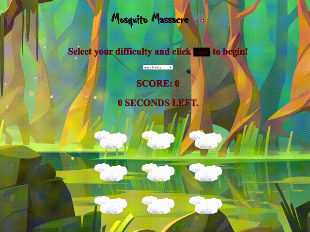

# Web Development Certificate Capstone: Whack-a-Mole!

This is my Capstone for my Web Development course - a Whack-a-Mole game! Here is my spin on the timeless classic as a mosquito smacking rampage. Original instructions for the assignment are located in `project-guide.md`. 

## Version History

|Version|Description|
|------|------|
| Version 1.01 **(CURRENT)** | Corrected the sound issue on GitHub deployment, added a title to the page, made minor adjustments to `README.md`|
| Version 1.0 | Fully updated `README.md` provided as well as several notes added in the `index.html`, `index.js`, and `styles.css` files. Final additions to the code includes updated tags and scripts to allow the cursor to animate upon a successful mosquito hit. |
| Version 0.9 | Separated `README.md` from `project-guide.md` and added a brief description, added music from the starter files, a splat sound effect on successful hits, gif versions of the original clouds, and moved everything remaining and unused into `assets/backup`. |
| Version 0.8 | Changed "Whack-a-Mole" game into a "Mosquito Massacre," changed the associated graphics for the each item (moles, holes, mallet, background), and modified the CSS to reflect these changes. |
| Version 0.7 | Followed directions in the original `README.md`, filled out `index.html`, `index.js`, and `styles.css` to have basic working game named "Gentry's Bonk Express." |

## How to Play

To begin the game, first select a difficulty level from the dropdown menu and then click start! Depending on your difficulty, mosquitoes will hover above the clouds for a longer or shorter duration. You can score more points by hitting each mosquito, and if you can click fast enough you may be able to get a combo on each one!

If you would like to have added sound for immersion, simply click the speaker icon next to the title of the page. It will enable the background music and sound effects for the game.
